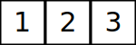

# Lists

To generate an SVG for a list simply call the constructor

```python
from algviz.list.listvisualizer import ListVisualizer

ListVisualizer("listVisualization.svg", [1,2,3], (150, 50))
```

Output:


